# Nexus-Dev

[](https://github.com/mmornati/nexus-dev/actions/workflows/ci.yml)
[](https://codecov.io/gh/mmornati/nexus-dev)
[](https://www.python.org/downloads/)
[](https://opensource.org/licenses/MIT)
[](https://github.com/astral-sh/ruff)

**Persistent Memory for AI Coding Agents**

Nexus-Dev is an open-source MCP (Model Context Protocol) server that provides a local RAG (Retrieval-Augmented Generation) system for AI coding assistants like GitHub Copilot, Cursor, and Windsurf. It learns from your codebase and mistakes, enabling cross-project knowledge sharing.

## Features

- 🧠 **Persistent Memory**: Index your code and documentation for semantic search
- 📚 **Lesson Learning**: Record problems and solutions that the AI can recall later
- 🌐 **Multi-Language Support**: Python, JavaScript/TypeScript, Java (extensible via tree-sitter)
- 📖 **Documentation Indexing**: Parse and index Markdown/RST documentation
- 🔄 **Cross-Project Learning**: Share knowledge across all your projects
- 🏠 **Local-First**: All data stays on your machine with LanceDB

## Installation

```bash
# Using pip
pip install nexus-dev

# Using uv (recommended)
uv pip install nexus-dev
```

## Quick Start

### 1. Initialize a Project

```bash
cd your-project
nexus-init --project-name "my-project" --embedding-provider openai
```

This creates:
- `nexus_config.json` - Project configuration
- `.nexus/lessons/` - Directory for learned lessons

### 2. Index Your Code

```bash
# Index specific directories
nexus-index src/ docs/ -r

# Index specific files
nexus-index main.py utils.py
```

### 3. Configure Your AI Agent

Add to your MCP client configuration (e.g., Claude Desktop):

```json
{
  "mcpServers": {
    "nexus-dev": {
      "command": "nexus-dev",
      "args": []
    }
  }
}
```

## MCP Tools

Nexus-Dev exposes 7 tools to AI agents:

### Search Tools

| Tool | Description |
|------|-------------|
| `search_knowledge` | Search all content (code, docs, lessons) with optional `content_type` filter |
| `search_code` | Search specifically in indexed code (functions, classes, methods) |
| `search_docs` | Search specifically in documentation (Markdown, RST, text) |
| `search_lessons` | Search in recorded lessons (problems & solutions) |

### Indexing Tools

| Tool | Description |
|------|-------------|
| `index_file` | Index a file into the knowledge base |
| `record_lesson` | Store a problem/solution pair for future reference |
| `get_project_context` | Get project statistics and recent lessons |

## Configuration

`nexus_config.json` example:

```json
{
  "project_id": "550e8400-e29b-41d4-a716-446655440000",
  "project_name": "my-project",
  "embedding_provider": "openai",
  "embedding_model": "text-embedding-3-small",
  "docs_folders": ["docs/", "README.md"],
  "include_patterns": ["**/*.py", "**/*.js", "**/*.java"],
  "exclude_patterns": ["**/node_modules/**", "**/__pycache__/**"]
}
```

### Embedding Providers

| Provider | Model | Dimensions | Notes |
|----------|-------|------------|-------|
| OpenAI | text-embedding-3-small | 1536 | Requires `OPENAI_API_KEY` |
| Ollama | nomic-embed-text | 768 | Local, no API key needed |

> ⚠️ **Warning**: Embeddings are NOT portable between providers. Changing providers requires re-indexing all documents.

## Optional: Pre-commit Hook

Install automatic indexing on commits:

```bash
nexus-init --project-name "my-project" --install-hook
```

Or manually add to `.git/hooks/pre-commit`:

```bash
#!/bin/bash
MODIFIED=$(git diff --cached --name-only --diff-filter=ACM | grep -E '\.(py|js|ts|java)$')
if [ -n "$MODIFIED" ]; then
    nexus-index $MODIFIED
fi
```

## Configuring AI Agents

To maximize Nexus-Dev's value, configure your AI coding assistant to use its tools automatically.

### Add AGENTS.md to Your Project

Copy our template to your project:

```bash
cp path/to/nexus-dev/docs/AGENTS_TEMPLATE.md your-project/AGENTS.md
```

This instructs AI agents to:
- **Search first** before implementing features
- **Record lessons** after solving bugs
- Use `get_project_context()` at session start

### Add Workflow Files (Optional)

```bash
cp -r path/to/nexus-dev/.agent/workflows your-project/.agent/
```

This adds slash commands: `/start-session`, `/search-first`, `/record-lesson`, `/index-code`

📖 See [docs/configuring-agents.md](docs/configuring-agents.md) for detailed setup instructions.

## Architecture

```mermaid
flowchart TB
    subgraph Agent["🤖 AI Agent"]
        direction TB
        Cursor["Cursor / Copilot / Windsurf"]
    end

    subgraph MCP["📡 Nexus-Dev MCP Server"]
        direction TB
        
        subgraph Tools["MCP Tools"]
            search_knowledge["search_knowledge"]
            search_code["search_code"]
            search_docs["search_docs"]
            search_lessons["search_lessons"]
            index_file["index_file"]
            record_lesson["record_lesson"]
        end
        
        subgraph Chunkers["🔧 Chunker Registry"]
            Python["Python"]
            JavaScript["JavaScript/TypeScript"]
            Java["Java"]
            Docs["Documentation"]
        end
        
        subgraph Embeddings["🧮 Embedding Layer"]
            OpenAI["OpenAI API"]
            Ollama["Ollama (Local)"]
        end
        
        subgraph DB["💾 LanceDB"]
            Vectors["Vector Storage"]
            Metadata["Metadata Index"]
        end
    end

    Agent -->|"stdio"| Tools
    Tools --> Chunkers
    Chunkers --> Embeddings
    Embeddings --> DB
```



### Data Flow

```mermaid
sequenceDiagram
    participant AI as AI Agent
    participant MCP as Nexus-Dev
    participant Embed as Embeddings
    participant DB as LanceDB

    Note over AI,DB: Indexing Flow
    AI->>MCP: index_file(path)
    MCP->>MCP: Parse with Chunker
    MCP->>Embed: Generate embeddings
    Embed-->>MCP: Vectors
    MCP->>DB: Store chunks + vectors
    DB-->>MCP: OK
    MCP-->>AI: ✅ Indexed

    Note over AI,DB: Search Flow
    AI->>MCP: search_knowledge(query)
    MCP->>Embed: Embed query
    Embed-->>MCP: Query vector
    MCP->>DB: Vector similarity search
    DB-->>MCP: Results
    MCP-->>AI: Formatted results
```



## Development

```bash
# Clone repository
git clone https://github.com/mmornati/nexus-dev.git
cd nexus-dev

# Setup environment
pyenv install 3.13
pyenv local 3.13
python -m venv .venv
source .venv/bin/activate

# Install dependencies
pip install -e ".[dev]"

# Run tests
pytest tests/ -v
```

## Adding Language Support

See [CONTRIBUTING.md](CONTRIBUTING.md) for instructions on adding new language chunkers.

## License

MIT License - see [LICENSE](LICENSE) for details.
