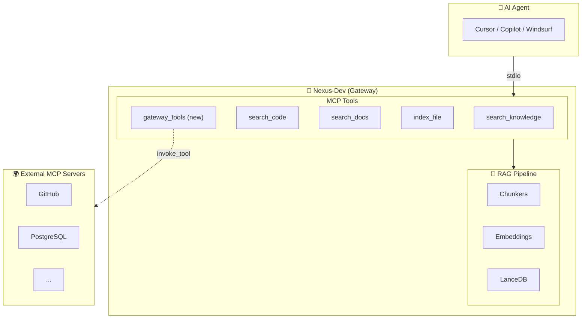
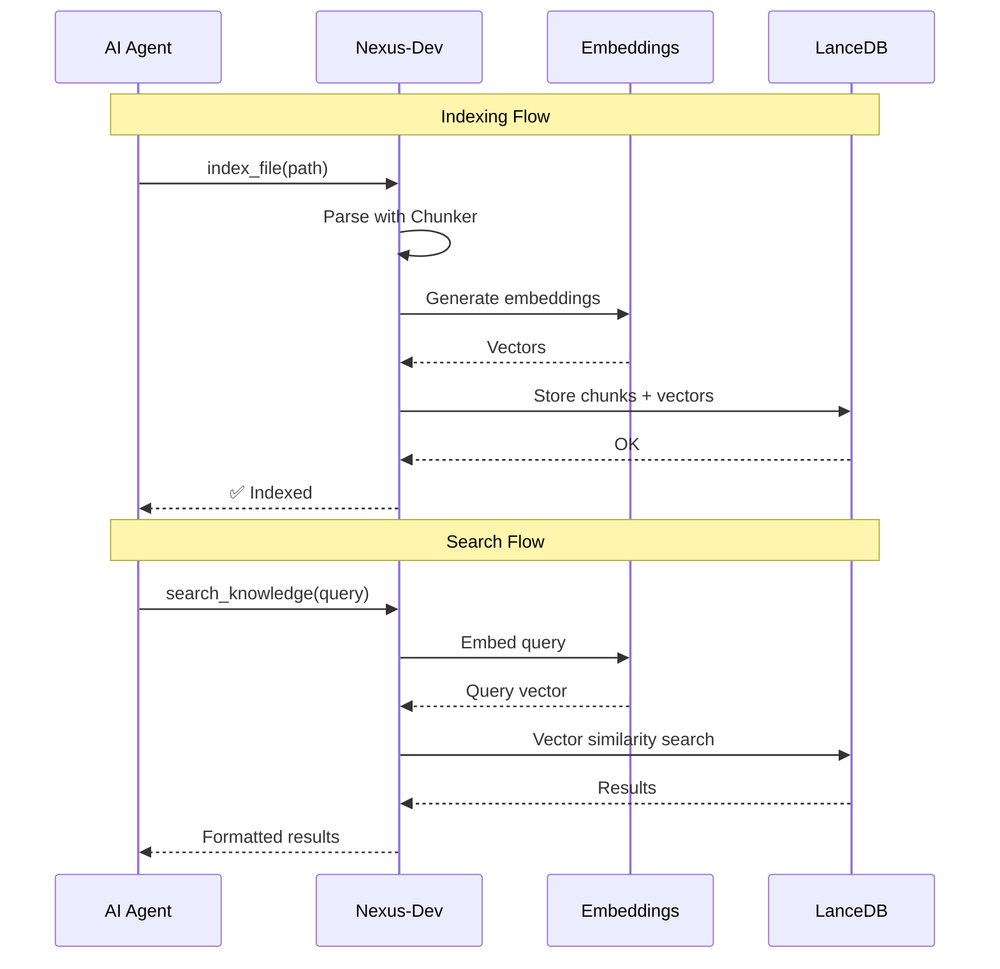

# Nexus-Dev Architecture

```mermaid
flowchart TB
    subgraph Agent["🤖 AI Agent"]
        direction TB
        Cursor["Cursor / Copilot / Windsurf"]
    end

    subgraph MCP["📡 Nexus-Dev (Gateway)"]
        direction TB
        
        subgraph Tools["MCP Tools"]
            direction TB
            search_knowledge["search_knowledge"]
            search_code["search_code"]
            search_docs["search_docs"]
            index_file["index_file"]
            gateway_tools["gateway_tools (new)"]
        end
        
        subgraph Chunkers["🔧 RAG Pipeline"]
            Python["Chunkers"]
            Embeddings["Embeddings"]
            DB["LanceDB"]
        end
    end

    subgraph External["🌍 External MCP Servers"]
        GH["GitHub"]
        PG["PostgreSQL"]
        Other["..."]
    end

    Agent -->|"stdio"| Tools
    Tools --> Chunkers
    gateway_tools -.->|"invoke_tool"| External
```

## Data Flow

```mermaid
sequenceDiagram
    participant AI as AI Agent
    participant MCP as Nexus-Dev
    participant Embed as Embeddings
    participant DB as LanceDB

    Note over AI,DB: Indexing Flow
    AI->>MCP: index_file(path)
    MCP->>MCP: Parse with Chunker
    MCP->>Embed: Generate embeddings
    Embed-->>MCP: Vectors
    MCP->>DB: Store chunks + vectors
    DB-->>MCP: OK
    MCP-->>AI: ✅ Indexed

    Note over AI,DB: Search Flow
    AI->>MCP: search_knowledge(query)
    MCP->>Embed: Embed query
    Embed-->>MCP: Query vector
    MCP->>DB: Vector similarity search
    DB-->>MCP: Results
    MCP-->>AI: Formatted results
```
