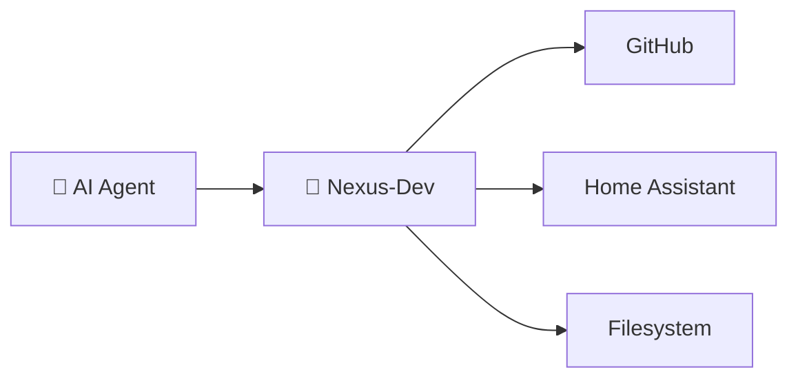

# Gateway Tools

Tools for accessing other MCP servers through Nexus-Dev.

---

## Overview

Nexus-Dev can act as a gateway to other MCP servers, reducing the number of tools your AI agent needs to manage. Instead of configuring 10 servers with 100+ tools, configure only Nexus-Dev and use these tools to access others.



---

## search_tools

Find MCP tools matching a description. Results are **cached** for 5 minutes to improve performance.

### Parameters

| Parameter | Type | Required | Default | Description |
|-----------|------|----------|---------|-------------|
| `query` | string | ✅ | - | Natural language description |
| `server` | string | | (all) | Filter to specific server |
| `limit` | int | | `5` | Maximum results (max: 10) |

### Caching

Results are automatically cached for 300 seconds. This reduces redundant searches and improves response time for repeated queries.

### Example

```
search_tools("create a GitHub issue")
```

**Response:**

```markdown
## MCP Tools matching: 'create a GitHub issue'

### 1. github.create_issue
**Description:** Create a new issue in a repository

**Parameters:**
{
  "owner": "string",
  "repo": "string",
  "title": "string",
  "body": "string",
  "labels": ["string"]
}

### 2. github.create_pull_request
**Description:** Create a pull request

**Parameters:**
{
  "owner": "string",
  "repo": "string",
  "title": "string",
  "body": "string",
  "head": "string",
  "base": "string"
}
```

---

## get_tool_schema

Get the full JSON schema for a specific tool.

### Parameters

| Parameter | Type | Required | Default | Description |
|-----------|------|----------|---------|-------------|
| `server` | string | ✅ | - | Server name |
| `tool` | string | ✅ | - | Tool name |

### Example

```
get_tool_schema(server="github", tool="create_issue")
```

**Response:**

```json
{
  "server": "github",
  "tool": "create_issue",
  "description": "Create a new issue in a repository",
  "parameters": {
    "type": "object",
    "properties": {
      "owner": {"type": "string", "description": "Repository owner"},
      "repo": {"type": "string", "description": "Repository name"},
      "title": {"type": "string", "description": "Issue title"},
      "body": {"type": "string", "description": "Issue body"},
      "labels": {"type": "array", "items": {"type": "string"}}
    },
    "required": ["owner", "repo", "title"]
  }
}
```

---

## invoke_tool

Execute a tool on a backend MCP server.

### Parameters

| Parameter | Type | Required | Default | Description |
|-----------|------|----------|---------|-------------|
| `server` | string | ✅ | - | Server name |
| `tool` | string | ✅ | - | Tool name |
| `arguments` | object | | `{}` | Tool arguments |

### Example

```
invoke_tool(
    server="github",
    tool="create_issue",
    arguments={
        "owner": "mmornati",
        "repo": "nexus-dev",
        "title": "Add webhook support",
        "body": "We should add webhook support for real-time updates.",
        "labels": ["enhancement"]
    }
)
```

**Response:**

```
Issue created: https://github.com/mmornati/nexus-dev/issues/42
```

---

## list_servers

List all configured MCP servers and their status.

### Example

```
list_servers()
```

**Response:**

```markdown
## MCP Servers

### Active
- **github**: `Command: npx -y @modelcontextprotocol/server-github`
- **homeassistant**: `SSE: http://homeassistant.local:8123/mcp`

### Disabled
- slack (disabled)
```

---

## get_gateway_prompt

Get the gateway system prompt for LLM context injection. This prompt provides the AI with instructions on how to use the gateway tools effectively.

### Example

```
get_gateway_prompt()
```

**Response:**

```markdown
## Nexus-Dev Gateway System Prompt

You have access to Nexus-Dev, a gateway to multiple MCP (Model Context Protocol) servers...

### Available Tools:
- search_tools: Find the right tool for a task
- invoke_tool: Execute a tool on a configured server
- list_servers: Show available MCP servers
...

### Workflow:
1. Use search_tools to find the appropriate tool
2. Use get_tool_schema to understand parameters
3. Use invoke_tool to execute the tool
```

### Use Case

Inject this prompt into your LLM's system message to ensure it properly uses the gateway:

```python
# Get the gateway prompt
gateway_prompt = get_gateway_prompt()

# Include in your LLM's system message
system_message = f"""
You are an AI assistant with access to various tools.
{gateway_prompt}
"""
```

---

## get_gateway_metrics

Get gateway usage statistics including tool calls, cache performance, and server usage.

### Example

```
get_gateway_metrics()
```

**Response:**

```markdown
Gateway Usage (last 24h):
- search_tools calls: 42
- invoke_tool calls: 156
- Cache hits: 89 (56.3%)
- Cache misses: 67

Tools by server:
- github: 98 calls
- filesystem: 35 calls
- homeassistant: 23 calls
```

### Metrics Tracked

| Metric | Description |
|--------|-------------|
| `search_tools_calls` | Total search_tools invocations |
| `invoke_tool_calls` | Total invoke_tool invocations |
| `cache_hits` | Number of cache hits |
| `cache_misses` | Number of cache misses |
| `server_calls` | Tool invocations per server |

---

## Gateway Workflow

The typical workflow for using gateway mode:

1. **Search for the tool**:
   ```
   search_tools("create a GitHub issue")
   ```

2. **Get detailed schema** (if needed):
   ```
   get_tool_schema("github", "create_issue")
   ```

3. **Invoke the tool**:
   ```
   invoke_tool("github", "create_issue", {...})
   ```

---

## Configuration

Configure downstream servers in `.nexus/mcp_config.json`:

```json
{
  "version": "1.0",
  "gateway": {
    "default_timeout": 30.0,
    "max_concurrent_connections": 5,
    "cache": {
      "enabled": true,
      "ttl_seconds": 300,
      "max_entries": 1000
    },
    "summarize": {
      "enabled": true,
      "max_list_items": 10,
      "max_output_chars": 500
    }
  },
  "servers": {
    "github": {
      "transport": "stdio",
      "command": "npx",
      "args": ["-y", "@modelcontextprotocol/server-github"],
      "env": {
        "GITHUB_PERSONAL_ACCESS_TOKEN": "ghp_..."
      },
      "enabled": true
    },
    "homeassistant": {
      "transport": "sse",
      "url": "http://homeassistant.local:8123/mcp",
      "enabled": true
    }
  }
}
```

See [Gateway Configuration](../advanced/gateway-config.md) for complete configuration reference including:
- Gateway settings (timeout, caching, summarization)
- Per-server overrides
- Server profiles
- Environment variables

---

## Benefits

| Without Gateway | With Gateway |
|-----------------|--------------|
| Configure 10 MCP servers | Configure 1 server |
| 100+ tools in context | ~20 core tools + search |
| Higher token usage | Lower token usage |
| Complex setup per IDE | One-time setup |

---

## See Also

- [Gateway Configuration](../advanced/gateway-config.md) - Complete config reference
- [nexus-mcp CLI](../cli/mcp.md) - Configure servers
- [nexus-index-mcp CLI](../cli/index-mcp.md) - Index tool schemas
- [Configuration](../getting-started/configuration.md#mcp-configuration) - Full setup guide
